## 缘起

进入本世纪，移动互联网、大数据、云计算、物联网、人工智能等新一代信息技术快速发展，促进形成了不同形态的新型计算系统。计算机人才的培养从“程序性开发能力”进化为更重要的“**系统性设计能力**”。要求计算系统开发人员必须了解不同系统平台的底层结构，具有系统观和系统思维，能够进行软硬件协同设计及其贯通，以强大的系统平台技术保证各项应用功能的实现，成为能力的关键特性，即**计算机系统能力**。计算机系统能力培养对于解决计算机领域卡脖子关键问题，培育我国高端芯片、关键基础软件的后备人才尤为紧迫和重要。

为此，2019年5月，教育部高等学校计算机类专业教学指导委员会授予我校计算机系统能力培养试点高校。我校正式开始计算机系统能力培养试点建设。2019年6月，我校与龙芯建立深度合作关系并签署了框架合作协议，与龙芯中科有限公司合作，成立龙芯华北基地暨龙芯-东北大学（秦皇岛）联合实验室。旨在培养计算机系统能力，以及为我国培养在卡脖子的计算机核心关键技术领域人才。2019年8月，创立龙芯班，主要培养中央处理器（CPU）、操作系统（OS）、编译器（Compiler），以及嵌入式芯片与系统设计等等。

| 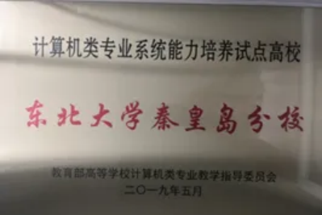 | 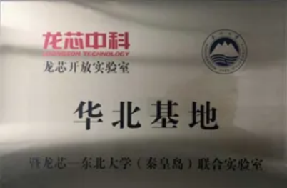 |
|:-:|:-:|
| 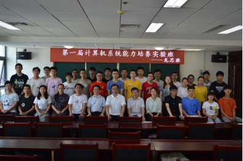 | 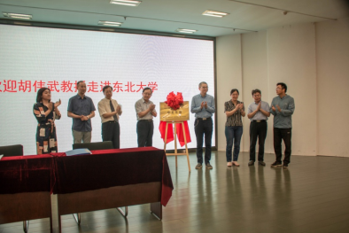 |

## 计算机系统能力竞赛

全国大学生计算机系统能力大赛旨在以学科竞赛推动专业建设和计算机领域创新人才培养体系改革，培育我国高端芯片、关键基础软件的后备人才，始终坚持围绕CPU、编译系统、操作系统、数据库管理系统的设计和实现，在赛题和赛制上不断推陈出新。2024年启动智能系统创新设计赛（小米杯）、智能计算创新设计赛（先导杯），形成了从计算机系统核心软硬件到完整系统的比赛格局。

作为“计算机类专业系统能力培养”教育生态的重要组成部分，大赛创办八年来，参赛学校、参赛人数不断增加，以赛促学、以赛促教的作用明显，学生的专业核心能力、工程能力、创新能力不断提升，2023年更是成功入选中国高等教育学会《2023全国普通高校大学生竞赛分析报告》竞赛目录，成为计算机领域重要的学科竞赛。

2024年，多家新闻媒体对赛事报道。钱江晚报，澎湃新闻网等媒体以“**继ACM后，计算机系统能力大赛受众多互联网大厂热捧，为啥？**”为标题对赛事进行报道。诸多互联网大厂越来越重视CPU，操作系统、编译器等自主化，它们也将目光投到大学系统人才培养上来。它们通过冠名全国大学生系统能力大赛，比如CPU大赛由“龙芯”冠名，编译系统设计赛由华为“毕昇”冠名，智能系统创新设计赛由“小米”冠名，以提前参与到大学系统设计开发人才培养中来。操作系统功能赛由华为、麒麟、龙芯、蚂蚁、OPPO、vivo、小米、龙蜥社区、国科环宇、飞腾等企业专家命题，吸引350支队伍报名，涉及863名同学和159位指导教师。“华为、龙芯等把它们公司的实际科技问题，拿到了比赛当中，看看在校大学生们怎么解决行业前沿问题，真正体现了业界需求和高校人才培养的‘双向奔赴’。

## 目标与规划

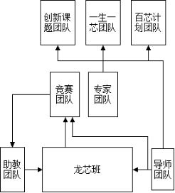

1. 以培养学员融会贯通计算机系统的软硬件知识，设计出自己的CPU，并在上面运行自己的操作系统，还在上面运行自己的编译器和数据库等系统软件为目标的龙芯班。  
目前，主要面向龙芯班学员开设两门公选课程《CPU设计艺术》和《操作系统》。其中，《CPU设计艺术》课程将于秋季学期十一后开课，《操作系统》将于春季学期开课。

2. 选拔龙芯班的优秀学员参加全国计算机系统能力竞赛，力争取得优异成绩。

3. 选拔龙芯班的优秀学员作为助教团队，辅导新学员学习。

4. 鼓励优秀学员，参加科创课题团队，一生一芯计划和百芯计划等活动，进一步树立投身科技事业的理想和锻炼能力。

## 指导教师

1. 方淼，男，东北大学计算机科学与技术专业工学学士学位，大连理工大学计算机应用技术专业工学博士学位，现任计算机工程系副主任（负责本部门教学工作），学院科研团队“语言与智能系统实验室”负责人，学院“计算机系统能力培养实验班（龙芯实验室）”负责人。目前主要从事自然语言理解，机器学习和计算机系统等方向的科研和教学工作。

2. 王鑫，男，1978年10月生，河北丰南人，东北大学计算机应用技术工学硕士学位，现任教于计算机科学系计算机科学与技术专业，讲师，主要从事教学工作。负责操作系统教学。

3. 张旭，女，1988年4月出生，河北迁西人，内蒙古大学计算机专业工学硕士学位，现任教于学院实验教学中心，实验师。目前主要从事实验教学工作，指导学生参加2019年（第12届）中国大学生计算机设计大赛软件应用与开发类决赛（作品：基于网络通信的远程解锁工具）荣获全国二等奖。负责CPU设计教学。

4. 科创课题指导教师暂未列出。

## 优秀学员

| Photo | Profile |
|:-:|:-:|
|  | 孟祥东，2017级，毕业进入龙芯公司基础软件部工作 |
|  | 杨兆鑫，2017级，考入中科院计算所龙芯实验室研究生 |
| 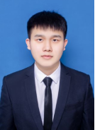 | 陈虹胜，2019级，毕业进入龙芯公司从事研发工作 |
| 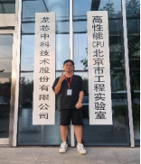 | 宋雨，2018级，毕业考入中科大先进研究院，现加入龙芯实验室从事研究工作 |
| 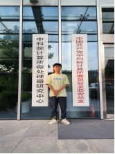 | 田宇，2018级，毕业考入中科大先进研究院，现加入龙芯实验室从事研究工作 |
|  | 付震宇，2019级，保送到中科大 USTC |
| 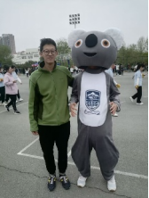 | 解博元，2020级，因竞赛优异成绩被华为免试录取 |

## 取得成绩

2020年，我校首次入围CPU赛道全国总决赛，荣获团队赛三等奖一项和个人赛三等奖一项。  
2021年，我校再创佳绩，在CPU赛道全国总决赛，获得团队赛三等奖两项，个人赛二等奖一项。  
2022年，我校继续入围CPU赛道全国总决赛，团队赛三等奖一项，个人赛三等奖一项。  
2023年，我们在全国总决赛CPU赛道获得团队赛三等奖两项，在OS赛道，获得团队赛三等奖一项，优胜奖一项。  
2024年，我们在全国总决赛智能系统创新设计赛道获得团队赛一等奖，在CPU赛道获得团队赛二等奖两项，在OS赛道，获得团队赛三等奖一项。  

| 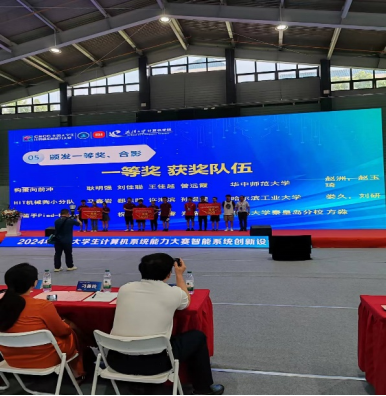 | 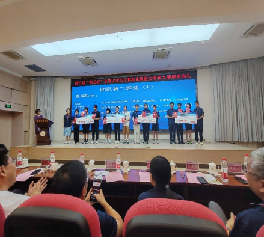 |
|:-:|:-:|

## 召唤

- 如果你有梦想，想设计自己的CPU，运行自己的OS，安装自己设计的编译器，请加入我们！
- 如果你有梦想，想在大学期间做一款自己的CPU产品，流出一块自己的芯片，请加入我们！
- 如果你有梦想，掌握计算机领域核心技术，到计算机系统能力大赛舞台展现实力，毕业到大厂工作，请加入我们！
- 如果你有梦想，希望掌握计算机核心技术，为科技强国做出自己的贡献，请加入我们！
- 加入我们，开启你的技术进阶之旅！与志同道合的伙伴一起，探索前沿技术，成就你的未来梦想！
- 强烈呼唤各位的到来，独行者速，众行者远！

报名要求：

- 热爱计算机系统和CPU、OS、Compiler设计，有志为国家计算机事业发展做贡献；
- 积极主动、坚持不懈，有较强的团队责任心和自学能力；
- 大一、大二，以及大三学生（能专心做芯片设计毕设，工作非考研的同学）。

招生规模：暂定为不超过60人  
开班日期：十一假期后  
报名截止日期： 2024年10月7号 24:00  
加入招新群：[231607730](https://qm.qq.com/q/aq8aBrqzwQ)  

联系人：  
白聪（OS方向）： QQ：1561331574，邮箱：[1561331574@qq.com](mailto:1561331574@qq.com)  
杨欣蕊（CPU方向）：QQ：1010191094，邮箱：[1010191094@qq.com](mailto:1010191094@qq.com)  
地点：基础楼304  