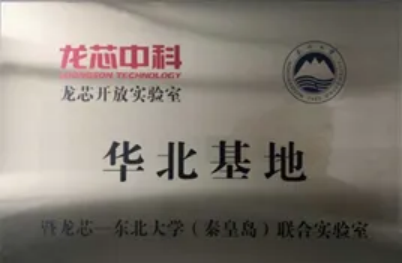
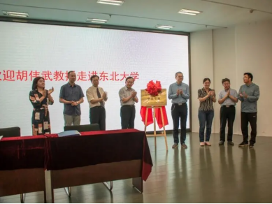
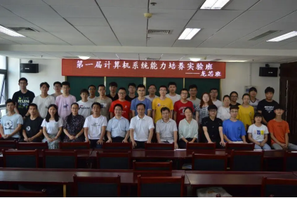
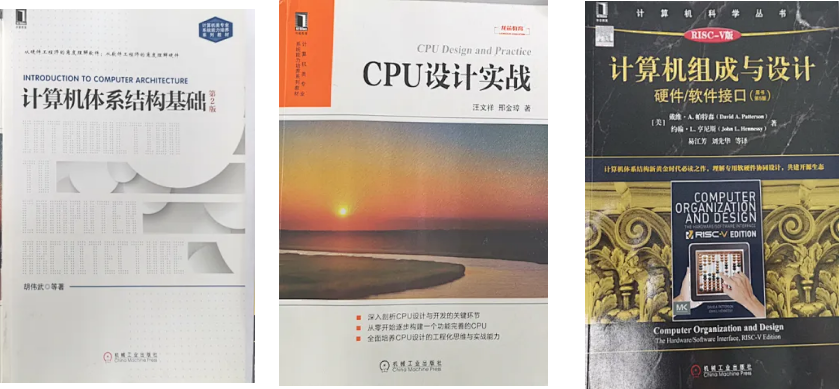
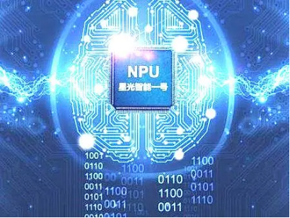
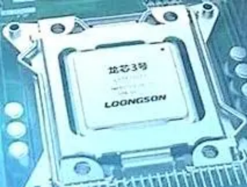

## 龙芯班的来历

2019年5月，教育部高等学校计算机类专业教学指导委员会授予我校系统能力培养试点高校，同年6月我校与龙芯建立深度合作关系，成立龙芯华北基地暨龙芯-东北大学（秦皇岛）联合实验室。计算机与通信工程学院与龙芯中科有限公司合作，首次开设系统能力培养实验班（简称龙芯班）。

|||
|-|-|
|||

了解更多龙芯相关问题可浏览以下链接：

龙芯官网： [http://www.loongson.cn](https://www.loongson.cn)  
全国大学生计算机系统能力大赛： [https://os.educg.net](https://os.educg.net)  

龙芯之父、中国科学院计算技术研究所总工程师 胡伟武 教授受计算机与通信工程学院之邀做客东北大学秦皇岛分校，于大学会馆三楼学术报告厅召开《自主CPU发展道路》讲座。

||||
|-|-|-|
||||

两届龙芯班合照

## 在龙芯班能收获到什么

龙芯班将 **计算机体系结构** 、**编译原理** 和 **操作系统** 三门课融入教学，经过老师和学员的共同努力，学员在计算机系统上的能力和对计算机体系结构的理解将会得到大幅度提高，将相关理论转化为实践的能力也会得到提升。

学业优秀的学生可参加全国大学生计算机系统能力大赛获得奖项（有利于保研加分和工作实习等）。

## 在龙芯班能学到什么

|||
|-|-|
|||

### 深入理解计算机系统

- 了解到与机器沟通的语言——mips指令集
- 高级编程语言程序代码是如何链接起来形成可执行目标文件的？
- mips 汇编指令被翻译成的二进制01的机器级代码是如何在 CPU 上执行的？
- 程序中对数据的处理在CPU中如何表示和运算？
- 指令执行过程中最重要的存储访问操作是如何进行的？
- 程序中各类控制语句对应的mips汇编代码结构是怎样的？

### 计算机系统硬件设计

- 硬件设计工具和编程语言（Vivado工具和verilog硬件描述语言）
- 单周期CPU设计
- 经典五级流水CPU设计
- CPU中对于指令处理过程中出现的中断和例外的处理
- 硬件并行加速执行指令技术的实现
- 对CPU进行优化使得CPU的性能达到高水平
- 利用设计出来的CPU搭建环境来实现对各种外部设备的接入运行
- 基于自己设计的CPU，实现自己的操作系统并在CPU上运行
- 操作系统是如何在运行应用程序以及控制CPU正常执行的
- 编译器设计及优化

### 操作系统内核架构设计

- 编程语言(c语言或rust)

## 龙芯班的成绩

|赛事 | 参赛队伍 | 指导老师 | 奖项 |
|:-:|:-:|:-:|:-:|
| 龙芯杯全国大学生系统能力大赛（CPU） | 焦哲，赵欣，陈聪昊，刘安迪 | 方淼、张旭 | 全国二等奖 |
| 龙芯杯全国大学生系统能力大赛（CPU） | 王淇，郭翀高翔，杨欣蕊，甘瑞杰 | 方淼、张旭 | 全国二等奖 |
| 全国大学生计算机系统能力大赛（OS） | 徐才益，薛丁豪，白聪 | 方淼、王鑫 | 全国三等奖 |

2023年，CPU赛道，团队赛三等奖两项。OS赛道 三等奖一项，优胜奖一项  
2022年，CPU赛道，团队赛三等奖一项，个人赛三等奖一项  
2021年，CPU赛道，团队赛三等奖两项，个人赛二等奖一项  
2020年，CPU赛道，团队赛三等奖一项，个人赛三等奖一项  