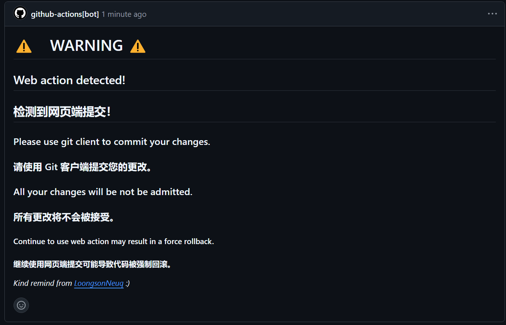
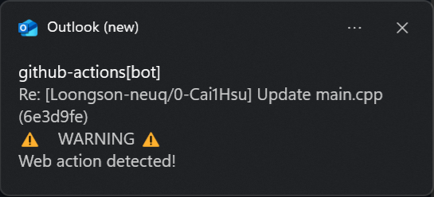

## 用 GitHub 网页端编辑文件

不要在 GitHub 网页端编辑文件！！！否则你会收到下面的警告:



以及一封邮件：



我们在将来可能会强制删除你的提交如果你继续在网页端编辑文件。

## ls -d ../*/

题目要求“列出父文件夹的文件夹项”。可能是翻译问题，Directory entry被我直接翻译成文件夹项可能导致大家（当然还有大家的好帮手 chatGPT）产生了误解，应当翻译为目录项更为准确。

Directory entry　是指一个文件夹内包含的如*文件夹*，*文件*，*链接*等项，因此只需要`ls ..`就可以列出父文件夹的目录项。

### 补充信息

ls 通过`getdents`系统调用获取目录项。`getdents`就是 get directory entries 的缩写。

[getdents syscall](https://www.man7.org/linux/man-pages/man2/getdents.2.html)

## 环境变量？

- 误区 - Where is Environment Variables?

我看到有同学说在 “`.bashrc` 里修改环境变量”，这种说法是不准确的。

环境变量是操作系统的一部分，不是某个文件里的内容。`.bashrc` 是一个 shell 脚本，用于配置 shell 的行为，它会在　Shell 启动时执行。因此你事实上是在 `.bashrc` 里添加了**修改**环境变量的命令。

### 那到底环境变量是储存在哪儿的呢？

环境变量是一个与**进程**绑定的概念。在进程被创建时，操作系统会将环境变量传递给进程。

#### 操作系统传递环境

在 `fork`，`exec` 等系统调用中，操作系统会在进程的地址空间中创建一个环境变量表，然后将**父进程**的环境变量表**复制**到**子进程**的环境变量表中。并在子进程的sp指针后面的某一个位置存放一个指向环境变量表的指针。

#### 进程接收环境变量

子进程刚开始运行时（在你们熟知的main函数前），会通过 sp 指针构造参数 `int argc`, `char *argv[]`, `char *envp[]`。`envp` 就是指向环境变量表的指针。这三个参数也是 C 语言的标准 main 函数签名的参数。

某些跨平台语言会对环境变量的接收方式进行封装，因为不同的操作系统可能有不同的实现。不过你仍然可以通过标准库的函数获取环境变量，例如　C# 的 `System.Environment.GetEnvironmentVariable()` 和 Python 的 `os.environ`。

## root 用户的命令提示符

普通用户的 shell 提示符通常是 `$` 或 `>`，而 root 用户的 shell 提示符通常是 `#`。

## 连续创建嵌套文件夹

记得添加 `-p` 选项。如

```bash
mkdir -p top/middle/bottom
```

## 重命名 `test` 文件夹为 `test1`？

可能错误的做法：

```bash
mv test/ test1/
```

正确的做法：

```bash
mv test test1
```

问题？
```bash
caiyi@LAPTOP-I80ETG8J /tmp > cd $(mktemp -d)
caiyi@LAPTOP-I80ETG8J /t/tmp.mABXKSHACy> mkdir test
caiyi@LAPTOP-I80ETG8J /t/tmp.mABXKSHACy> mv test/ test1/
caiyi@LAPTOP-I80ETG8J /t/tmp.mABXKSHACy> ls
test1/
caiyi@LAPTOP-I80ETG8J /t/tmp.mABXKSHACy> # test 被重命名
caiyi@LAPTOP-I80ETG8J /t/tmp.mABXKSHACy> mkdir test
caiyi@LAPTOP-I80ETG8J /t/tmp.mABXKSHACy> mv test/ test1/
caiyi@LAPTOP-I80ETG8J /t/tmp.mABXKSHACy> ls
test1/
caiyi@LAPTOP-I80ETG8J /t/tmp.mABXKSHACy> ls test1/
test/
caiyi@LAPTOP-I80ETG8J /t/tmp.mABXKSHACy> # test 被移动
```

## Fork 仓库再提交？

课上说

## 工作目录问题

课上说

## 最后

提醒大家不要过度相信 AI，AI 可能会给出错误的答案。即使 AI 给出了正确答案，你也要自己去理解才能更好地掌握知识。

有的同学的答案太离谱了，完全就是 AI 生成的答案。题目明明是一张图片，但是直接把 markdown 原文复制给 AI，AI 又看不到图片，就只能回答“这是一张图片”。

但是并不是反对大家使用 AI，只是要保存怀疑和求证的态度，以及自己的思考能力和学习能力。
